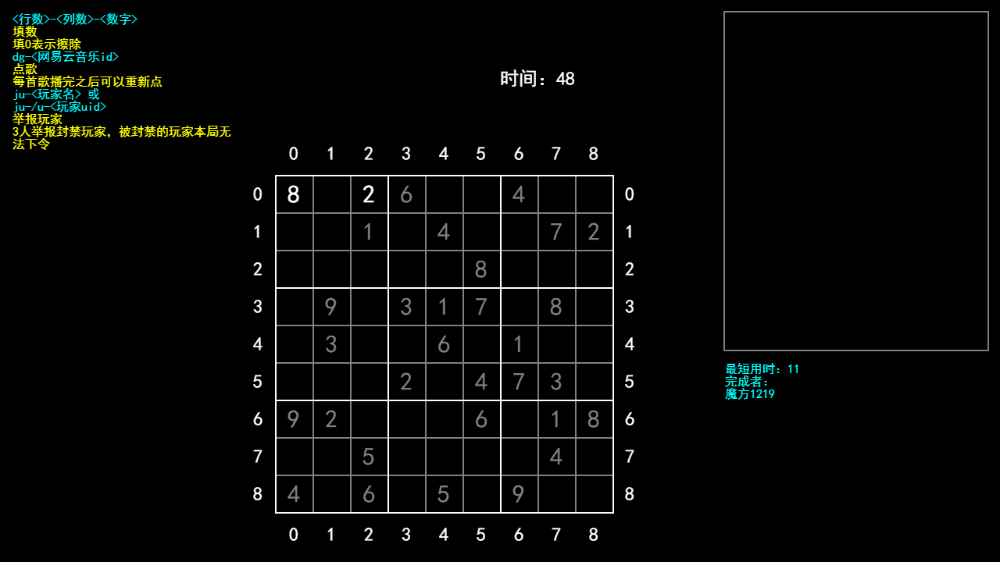

# 弹幕互动游戏
由直播观众作为玩家，发送弹幕进行操作的游戏。  
分为弹幕扫雷、弹幕数独两个小游戏。  
只支持Bilibili平台。
## 用法
1. 安装`NodeJS`和`electron`。
2. 用`npm start`执行程序。  

## 文件说明  
* `index.html`：主文件。当前该文件中指定开始的是数独游戏。如果要改成扫雷游戏，把其中的`sudoku.js`改成`mine-sweeping.js`，或者把`mine-sweeping.html`重命名成`index.html`即可。
* `index.js`：游戏的主框架。当前游戏默认连接到Bilibili直播间`4449590`（魔方12139的直播间），如需修改，在创建`bs`变量时指定所需的直播间号码。
* `mine-sweeping.js`：扫雷游戏的逻辑主体。具体玩法和规则见游戏中说明。
* `sudoku.js`：数独游戏的逻辑主体。同上。
* `sudoku-problem-*.txt`：数独游戏的题目。0, 1, 2, 3分别代表四个不同的难度。如果需要更换题目，可以修改其内容。
* `生成器网站.txt`：数独游戏题目生成器网站。可以利用其中的`JavaScript`脚本从该网站获取题目。

更多信息请自行阅读各文件内容。
## 预览

## 鸣谢
* Bilibili UP主红色xyz（322954448）。程序中直播间连接与弹幕抓取部分参考了他的专栏。